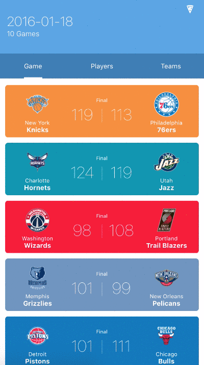
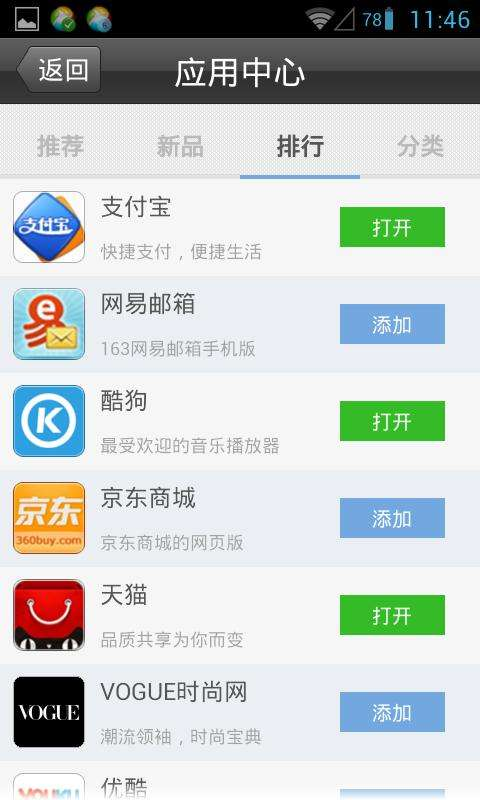
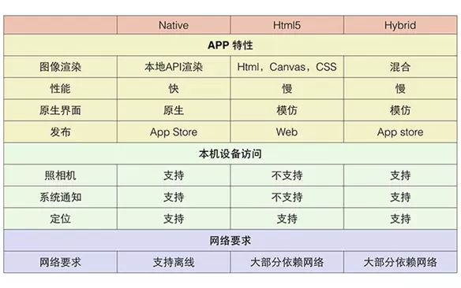
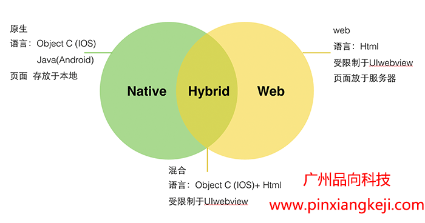

# APP SEARCH

<a href="#introduction">INTRODUCTION</a>

<a href="#examples">EXAMPLES</a>

<a href="#compare">COMPARATION</a>

<a href="#choice">CHOICE</a>

<a href="#sourceNote">REFERENCE</a>

****
## INTRODUCTION

### NATIVE APP

中文名称为“原生app”.

基于智能手机本地操作系统如iOS、Android、WP并使用原生程式编写运行的第三方应用程序，一般开发的语言为Java、C++等。在使用上的具体表现就是，**手机桌面上的图标点进去基本就是native app了**。

### WEB APP

基于web的系统和应用，运行于网络和浏览器之上，目前多采用h5标准开发。在使用上的具体表现是，手机浏览器点击进入，会有一些应用的小图标，这些小图标在点击后，在浏览器里加载的页面 跟你直接下载一个app后打开的页面是相同的，**这些小图标代表的就是web app**。

### HYBRID APP

中文名称是“混合app”.

顾名思义，就是 native app 与 web app的混合。在native app里内置浏览器，合适的功能页面采用网页的形式呈现。比如**京东的某些营销页面，今日头条的某些新闻页面、微信的腾讯新闻的内容页面**等。

 

</a>

***

## EXAMPLES

### 手机京东：

这是一款Hybrid APP，进入首页，我的页面是用原生开发的，其中数据时通过接口加载后台数据的，购物车也是原生编写，里面数据是后台获取数据（购物车是我怀疑的，需进一步考证）。首页其他几个顶部和底部是用原生开发的，中间加载的是H5网页，其中它会将页面做缓存，下次没有网络情况下显示缓存的页面，首次进入页面没有缓存，没有网络它会跳转到一个指定的页面，

### 淘宝：

这是一款原生开发为主，进入首页它的底部导航按钮和顶部都是用原生编写的，中间页面也是原生开发，其中里面的数据是从后台获取，用户体验效果还是很好的。

对比京东和淘宝：很明显，淘宝的用户体验效果比京东好，京东的可扩展性是远远高于淘宝的。

 

</a>

***
## COMPARATION

### NATIVE APP:

#### 优点：

* 提供最佳用户体验，最优质的用户界面，流畅的交互

* 可以访问本地资源，支持大量图形和动画，反应快。

* 可以调用移动硬件设备，比如摄像头、麦克风等

#### 缺点：

* 开发成本高。每种移动操作系统都需要独立的开发项目，针对不同平台提供不同体验；
 
* 发布新版本慢。下载是用户控制的，很多用户不愿意下载更新（比如说，版本发布到了3.0，但还是有很多1.0的用户，你可能就得继续维护1.0版本的API）

* 应用商店发布审核周期长。安卓平台大概要1~3天，而iOS平台需要的时间更长

### WEB APP:

#### 优点：

* 不需要安装包，节约手机空间

* 整体量级轻，开发成本低、周期短。

* 不需要用户进行手动更新，由应用开发者直接在后台更新，推送到用户面前的都是全新版本，更便于业务的开展

* 基于浏览器，可以跨平台使用

* 数据可以被搜索引擎的爬虫抓到，并进行索引。如果产品只有一个app，那么它的入口独立，但同时数据也是封闭的。如果用户从搜索引擎查找的话，是找不到相关信息的。所以做成web app，可以被搜索引擎找到

* 用户碎片时间使用，例如一些黏性不高的应用，比如 移动搜索、网址导航等

#### 缺点：

* 页面跳转费力，不稳定感更强。在网速受到限制时，很多时候出现卡顿或者卡死现象，交互效果受到限制

* 安全性相对较低，数据容易泄露或者被劫持.

* 对联网要求高，离线不能做任何操作；

* 功能有限；

* 图片和动画支持性不高；

* 与浏览器相关，如果用户使用更多的新型浏览器，那么就会出现运行问题 

### Hybrid app

#### 优点：

* 在实现更多功能的前提下，使得app安装包不至于过大

* 在应用内部打开web网页，省去了跳转浏览器的麻烦

* 主要功能区相对稳定下，增加的功能区采用web 形式，使得迭代更加方便
web页面在用户设置不同的网络制式时会以不同的形式呈现（以微信朋友圈为例，在数据流量下，设置APNS为WAP时，微信订阅号内容将屏蔽图片和视频。这样就能为用户省去一部分流量，整个页面阅读就不那么友好了）

#### 缺点：

* 采用融合native和Web的方法摈弃了任何离线可用性，因为设备与网络没有连接时，无法访问设备

* 把Web代码封装到APP里面难以远程更新

 

***

## CHOICE

* 如果app中出现了大段文字（如新闻、攻略等），并且格式比较丰富（如加粗、字体多样等），采用H5较好。原因：原生开发对解析json字符串格式不是很友好

* 如果讲究app反应速度（含页面切换流畅性），采用原生开发。原因：H5本质上是网页，换网页的时候，基本要加载整个页面，就像一个浏览器打开一个新的网页一样，比较慢，而原生系统只需要加载变化的部分

* 如果app对有无网络、网络优劣敏感（譬如有离线操作、在线操作），则采用原生开发。虽然H5可以做到，但是比较敏感

* 如果app要频繁地调用硬件设备（比如摄像头、麦克风等），则采用原生开发，这样支持硬件更多，调用速度更快，H5望尘莫及

* 如果app用户常见页面频换（如淘宝首页的各种营销活动），采用H5，维护起来更容易

* 如果预算有限（H5开发一套可在安卓、iOS、黑莓等跨平台使用）、不在乎用户体验、不在乎加载速度，肯定是H5

* 短期活动，专题营销类的页面居多的，可以选择原生app搭建框架，详细页面采用H5,便于活动的随时修改和管理

* 主要业务流程方面，选择原生app开发，有更好的用户体验，也可以更方便的拓展其他功能

 

***
## REFERENCE:

https://www.jianshu.com/p/24bf070a4dcb

https://www.jianshu.com/p/4513224ebdde

https://www.cnblogs.com/gzpxkj/p/6155497.html

https://blog.csdn.net/qq_32973011/article/details/72396716
